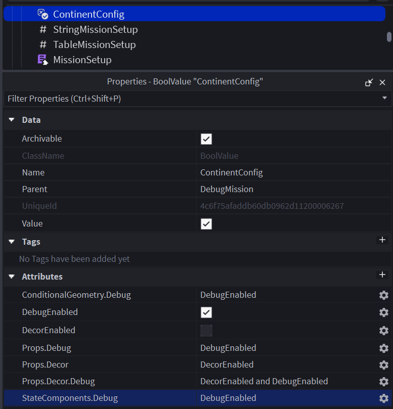

# InfiltrationEngine-ContinentController
A plugin for InfiltrationEngine designed for creation of toggleable "Continents" containing map elements, for ease of debugging and mission development velocity.

> [!NOTE]
> ContinentController will NOT function when used alongside outdated versions of the Custom Mission Exporter - if the plugin appears to be non-functioning, check your Script Output tab for information as to why.

## Usage
The plugin adds support for a "ContinentConfig" `BoolValue` directly inside of the `DebugMission` folder.

> [!WARNING]
> Your ContinentConfig WILL be ignored if it's `Value` property isn't set to true!

The ContinentConfig's attributes are used to directly configure two things:
1) The rule constants
2) The Continent rules

These will be explained individually, before providing examples.

### Rule Constants
Rule Constants can be thought of as the settings you have set up to enable/disable Continents, they are boolean values which may be true/false.

For instance, if I wanted a setting for toggling Debug folders, I would add an attribute titled `Debug` to the ContinentConfig, and set it to `true` when I want my debug folders to be exported.

### Continent Rules
Continent rules express the conditions that a Continent may be exported under. They are string values which comprise a short boolean expression using the Rule Constants.

For instance, if I wanted `DebugMission/Props/Detail/Debug` to only be visible when both `Debug` *and* `Detail` are true, I would add a `Props.Detail.Debug` attribute to the ContinentConfig, with a value of `Debug and Detail`.

The following keywords are officially supported in Continent Rules:
- `and`
- `or`
- `not`
- `return`

> [!NOTE]
> Rules may optionally begin with the "return" keyword, as they are currently implemented via `loadstring`

> [!TIP]
> Due to their implementation, rules have access to comparison operators such as `==`, `~=`, etc.
>
> While not explicitly an intentional feature, this is unlikely to be removed in future.

### Example
An example of a properly configured ContinentConfig is depicted below, note the `Value` property is set to `true`, as the config will be disabled otherwise.  

## Trivia
- The "Continent" terminology is borrowed from the Diesel engine of PAYDAY: The Heist and PAYDAY 2 fame, wherein toggleable Continents may contain map elements only present in certain versions of the map, such as console-specific, or level-editor-specific elements.